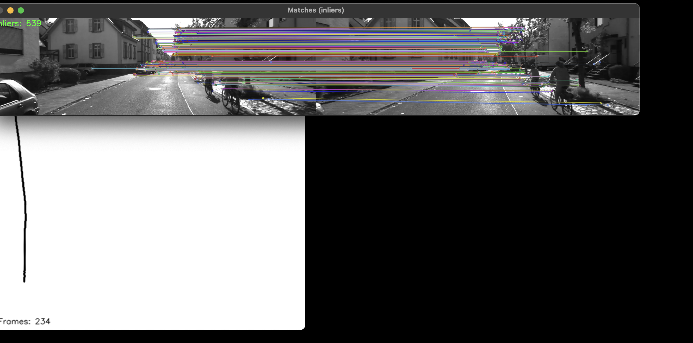
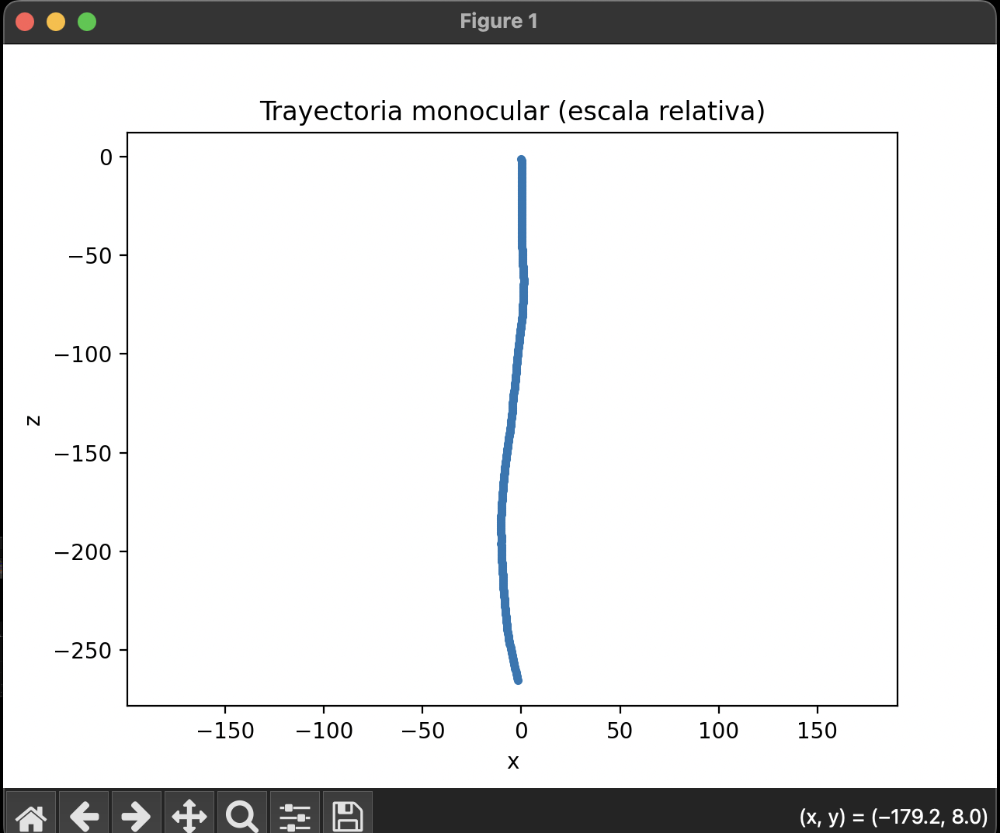
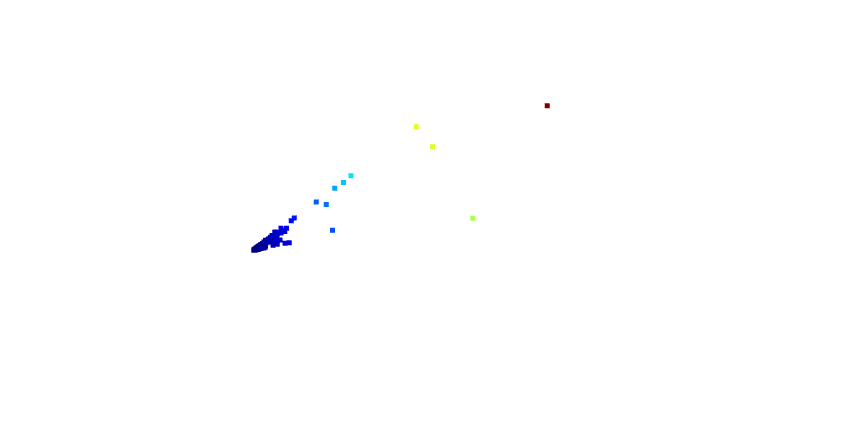

# VO-Básico

Un intento de aprender **SLAM monocular**.

La idea es:

- Estimar el movimiento de una cámara (**odometría visual**) y dibujar su trayectoria.
- Guardar la información (matrices y puntos 3D) del recorrido.
- Triangular una nube de puntos 3D.
- Generar un mapa 2D tipo “aspiradora” (**Occupancy Grid**) desde los puntos.
- Probar en tiempo real con cámara o video.

> **Nota:** Al ser **monocular** (única cámara y por ende único input), la **escala es relativa** (no hay unidades reales sin una referencia externa).

---

## Estructura

```
vo-brigitte/
├─ vo.py                   # Demo de matches ORB (visualización rápida)
├─ vo_pose.py              # Odometría: calcula R,t + trayectoria 2D + guarda trajectory.npy
├─ plot_traj.py            # Script para graficar la trayectoria guardada
├─ vo_triangulate.py       # Triangula nube de puntos 3D desde la trayectoria → points.npy (+ colors.npy)
├─ viz_points.py           # Visualiza la nube 3D con Open3D
├─ gridmap_from_points.py  # Genera un mapa 2D (Occupancy Grid) desde points.npy
├─ live_mapper.py          # Versión en tiempo real: VO + triangulación + grid (cam/video/fotos)
├─ test1.mp4               # Video de prueba principal
├─ ort.MOV                 # Otro video de prueba
├─ requirements.txt    
├─ README.md
└─ .gitignore
```

---

## Requisitos

- Python **3.9+** (probado en macOS y Windows 10/11)
- Paquetes: ver `requirements.txt` (OpenCV, NumPy, Matplotlib, Open3D, etc.)

---

## Quickstart

### 1. Crear entorno virtual e instalar dependencias

```bash
# mac / linux
python3 -m venv .venv
source .venv/bin/activate

# windows (PowerShell)
.venv\Scripts\activate

pip install -r requirements.txt
```

---

### 2. Ejemplos de uso

#### a) Odometría visual simple

Con video:

```bash
python vo_pose.py --video ort.MOV --show-matches
```

Con webcam:

```bash
python vo_pose.py --camera 0 --show-matches
```

Esto genera `trajectory.npy`.

---

#### b) Graficar trayectoria

```bash
python plot_traj.py
```

---

#### c) Triangulación 3D

```bash
python vo_triangulate.py --video test1.mp4 --show --save-colors   --max-feats 1500   --ratio 0.80   --reproj-th 6.0   --kf-stride 10
```

Genera `points.npy` (+ `colors.npy`).

---

#### d) Visualizar nube 3D

```bash
python viz_points.py
```

---

#### e) Generar Occupancy Grid desde points

```bash
python gridmap_from_points.py --use_open3d --cell 0.05 --height_thresh 0.15 --downsample 2
```

---

#### f) **Tiempo real con cámara / video / fotos** (`live_mapper.py`)

Cámara:

```bash
python live_mapper.py --camera 0
```

Video:

```bash
python live_mapper.py --video ort.MOV
```

Carpeta de imágenes:

```bash
python live_mapper.py --images_dir frames/ --ext .jpg
```

Con opciones adicionales:

```bash
python live_mapper.py --camera 0 --draw_on_last --save_every 60
```

- `--draw_on_last`: pega mini trayectoria sobre el último frame
- `--save_every N`: guarda un snapshot cada N frames
- `--poses_csv`: exporta poses a CSV

---

### 3. One-shot runner

- **Windows**:  
  `run.bat`

- **Linux/Mac**:  
  ```bash
  ./run.sh
  ```

---

## Resultados

Ejemplo de visualizaciones:





