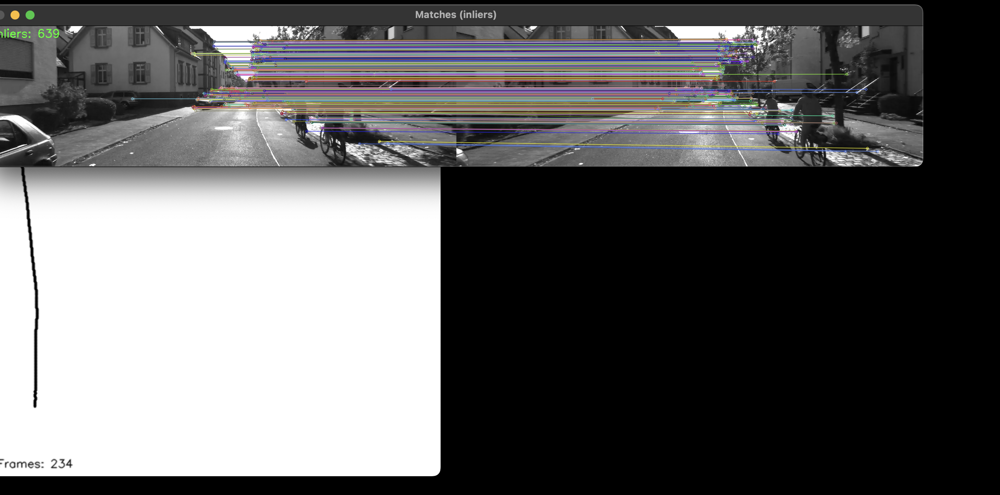

# VO-Básico 

Un intento de aprender slam. La idea es estimar el movimiente de una cámara (odometría visual) y dibujar esa trayectoria. Luego se guarda la "información" (matrices) del recorrido y se realiza un grafico.

> Nota: Al ser **monocular** (única camara y por ende único input), la **escala es relativa** (no tenés unidades reales sin una referencia externa).

## Estructura

VO-basic/
├─ vo.py # demo de matches ORB (visualización)
├─ vo_pose.py # odometría: R,t + trayectoria 2D + guardado .npy
├─ plot_traj.py # script para graficar la trayectoria guardada
├─ ort.MOV # video de prueba
├─ test1.mp4  # video de prueba, este es con el que mejor  anda
├─ requirements.txt
└─ .gitignore

## Modo de uso
-   Python 3.9+ (probado en macOS)
- Paquetes: ver `requirements.txt`
 primero crear un entorno virtual 

 python3 -m venv .venv
source .venv/bin/activate

pip install -r requirements.txt

Luego correr el archivo principal aclarando el video
# python3 vo_pose.py --video ort.MOV --show-matches
o con webcam:
# python3 vo_pose.py --camera 0 --show-matches

en esta etapa se va a crear un archivo .npy y se puede graficar la trayectoria 
python3 plot_traj.py

